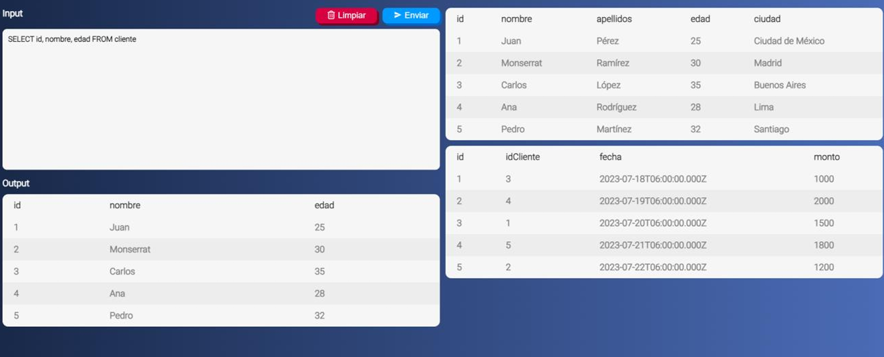
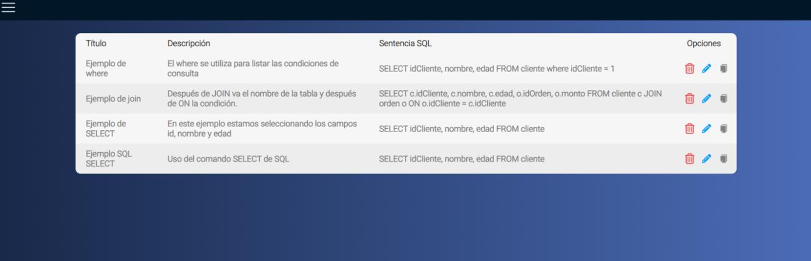
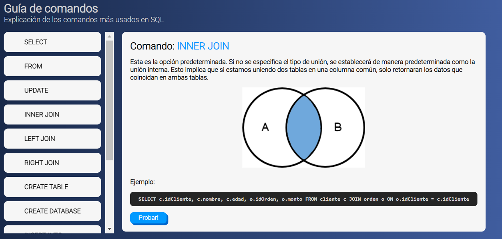
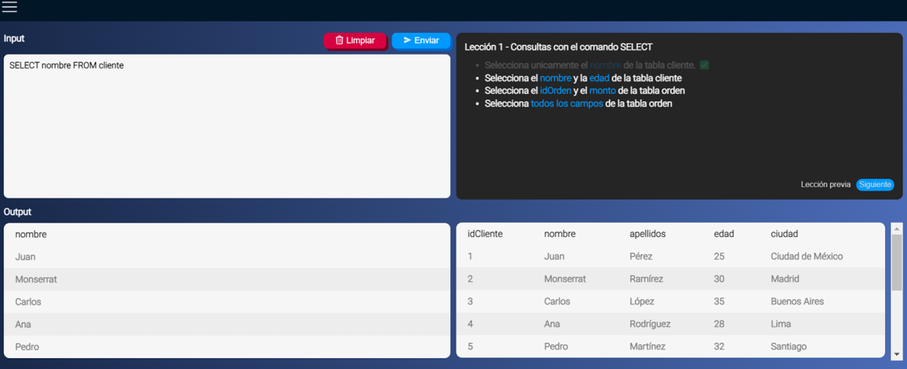

**SQL Learning Tool 💻**

# Summary ✅

System able to execute SQL statements online. 
The system consists of a web application with a simple user interface where we will write the statements and send them by HTTP requests to a server connected to a database,
the response of the statement will be displayed in the same user interface, without the need to install a database handler 
or other type of additional software and without any configuration.

Translated with DeepL.com (free version)

# Technologies used 🔧

# Application 🧑‍💻

**Main Page**

On the main page we can see de main textbox where we can write our SQL statements, we can also see the available tables in every moment and below we have the response of our statements.

**Saved Statementes**

We can save any statement in our account and consult it at any time.

**Command Guide Page**

We have a page where we can consult the description, sintax and an example of the most used commands.

**Practical Exercises**

Finally we have a section where we can do some practical exerices.

**credit: Moisés Hernández**
